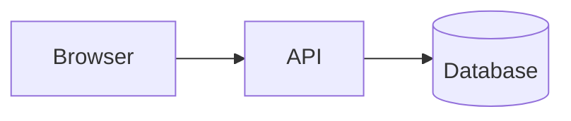

# MDX Integration (/docs/guide/mdx-guide)


Choose the authoring path [#choose-the-authoring-path]

MDX already supports JSX, so most React documentation sites do not need a DiaX-specific MDX
package. Choose by the source you already own:

| Source                                                        | Recommended path                  | Why                                                                      |
| ------------------------------------------------------------- | --------------------------------- | ------------------------------------------------------------------------ |
| Nodes and relations from frontmatter, an API or reviewed data | `@diax/react`                     | Keep one serializable topology and render rich DOM content               |
| A small topology authored directly beside the prose           | `@diax/react/jsx`                 | Concise JSX syntax for a static visual explanation                       |
| Existing Mermaid fences in trusted source files               | `remark-diax`                     | Transform supported fences during the MDX build and report invalid input |
| Untrusted AI or user output                                   | Validated JSON into `@diax/react` | Do not execute generated MDX, imports or JSX                             |

<Callout type="warn">
  MDX is application source: it can execute JavaScript and JSX. Compile AI-generated MDX only
  after review. For untrusted runtime output, accept a constrained JSON schema, validate it, and map
  known values to application-owned components.
</Callout>

Plain MDX composition [#plain-mdx-composition]

Install the React binding and import it in the MDX file or register it in the site's shared MDX
component map.

<InstallTabs packages="['@diax/react']" description="React binding for data-first diagrams in trusted MDX" />

This complete component is checked by the documentation contract:

```tsx title="components/RequestPathDiagram.tsx" contract
import { FlowDiagram } from '@diax/react';

export function RequestPathDiagram() {
  return (
    <FlowDiagram
      nodes={[
        { id: 'browser', content: 'Browser' },
        { id: 'api', content: 'API' },
        { id: 'database', content: 'Database' },
      ]}
      relations={['browser->|HTTPS|api', 'api->|SQL|database']}
      density="comfortable"
    />
  );
}
```

Then import the component from a trusted `.mdx` document:

```mdx title="content/architecture.mdx"
import { RequestPathDiagram } from '../components/RequestPathDiagram';

# Request path

<RequestPathDiagram />
```

The MDX block is intentionally a document fragment, not a standalone TypeScript module. The
`RequestPathDiagram.tsx` module above is the copy-pasteable contract.

Register shared components [#register-shared-components]

Frameworks expose different MDX registries, but DiaX does not require a special runtime adapter.
For Fumadocs, extend its normal component map:

```tsx title="app/docs/[[...slug]]/page.tsx"
import { FlowDiagram, Mindmap } from '@diax/react';
import defaultMdxComponents from 'fumadocs-ui/mdx';

// Configuration fragment: merge this object into the page's existing MDX setup.
export const diaxMdxComponents = {
  ...defaultMdxComponents,
  FlowDiagram,
  Mindmap,
};
```

Nextra uses `mdx-components.tsx`; Docusaurus uses its MDX component scope. In all three cases, the
important contract is the same: register the public React components, keep topology in one source,
and load the component from a client boundary when the host performs server rendering.

See [React SSR](/docs/react/ssr) for Next.js and hydration requirements.

Reusable presentation [#reusable-presentation]

Extract repeated visual policy into an ordinary React component rather than repeating configuration
throughout prose:

```tsx title="components/ArchitectureDiagram.tsx" contract
import { FlowDiagram, type FlowDiagramProps } from '@diax/react';

export function ArchitectureDiagram(props: FlowDiagramProps) {
  return <FlowDiagram density="spacious" {...props} />;
}
```

Keep complex data in a `.ts` module and import it into the wrapper or MDX document. Do not map data
arrays back into `DiaxNode` and `DiaxEdge` markers; the data interface already represents that
topology directly.

Mermaid fences in trusted MDX [#mermaid-fences-in-trusted-mdx]

Use `remark-diax` when a documentation repository already owns Mermaid fences and wants automatic
build-time conversion:

<InstallTabs packages="['remark-diax', '@diax/ui-react', '@diax/react', '@diax/mermaid']" description="Build-time fence transformation plus the explicit Mermaid renderer leaf" />

Import `@diax/ui-react/styles.css` once from the host's global stylesheet. The plugin automatically
injects the `SmartMermaidDiagram` import for a valid fence; the host does not register a hidden
global component.

````md title="content/system.mdx"

````

Invalid or unsupported source remains visible as its original code block. The plugin also appends
standard VFile messages, allowing a live preview to show markers while CI applies a stricter policy.
It does not introduce another diagram language and it does not claim full Mermaid compatibility.

For the complete ESM setup, options, supported fence aliases, VFile fields, build policy and
Fumadocs/Docusaurus examples, use the [`remark-diax` Reference](/docs/reference/remark-diax).

Mermaid without a Remark build [#mermaid-without-a-remark-build]

For a single React MDX page, render the explicit optional leaf directly:

```tsx title="components/ImportedDiagram.tsx" contract
import { SmartMermaidDiagram } from '@diax/ui-react/mermaid';

export function ImportedDiagram() {
  return (
    <SmartMermaidDiagram
      chart={`flowchart LR
        author[Author] --> build[MDX build]
        build --> reader[Reader]`}
    />
  );
}
```

This path is often simpler than configuring a Remark plugin for one diagram. See the
[Mermaid Guide](/docs/guide/mermaid) for supported syntax and fidelity limits.

Authoring rules [#authoring-rules]

1. Keep one topology definition; use rich DOM only for presentation.
2. Put complete reusable code in `.tsx` modules and keep MDX fragments short.
3. Treat MDX as trusted executable source, never as an untrusted runtime payload.
4. Use the data interface for generated or external nodes and relations.
5. Import Mermaid and its UI renderer only on routes that need them.
6. Let VFile diagnostics drive editor markers and build policy; do not silently drop invalid fences.

Next steps [#next-steps]

* [React Guide](/docs/react) — data and JSX authoring interfaces
* [`remark-diax` Reference](/docs/reference/remark-diax) — build integration and diagnostics
* [Mermaid Import](/docs/guide/mermaid) — supported source and runtime rendering
* [AI Integration](/docs/guide/ai-integration) — validation and trust boundaries
* [Package Entry Points](/docs/reference/package-entry-points) — loading and tree-shaking boundaries
